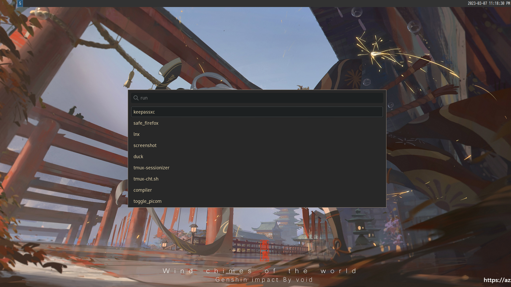
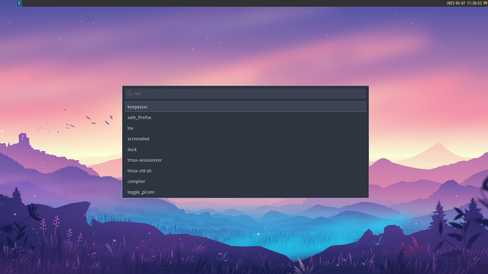
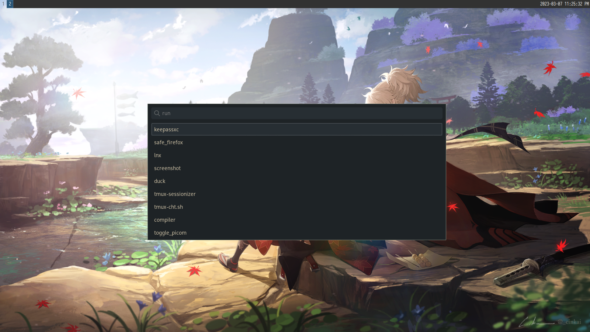

# wofi-themes-collection
 Themes Collection for Wofi Launcher

## Screenshots

### Gruvbox


### Nord


### Everforest


### Solarized


## Installing themes

1. Clone this repository and change to its directory:
```
$ git clone https://github.com/joao-vitor-sr/wofi-themes-collection
$ cd wofi-themes-collection
```

2. If you don't have the directories needed for the install create them with:
```
$ mkdir -p ~/.config/wofi
```

3. Copy your desired theme to `~/.config/wofi` folder:
```
$ cp themes/<your-selected-theme> ~/.config/wofi/style.css
```

Enjoy your new Wofi theme!
